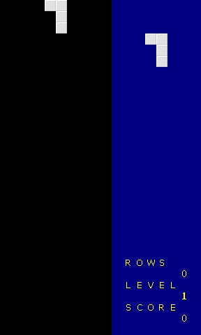

# SW Falling Blocks - SDL2 port

This repository is a Linux/SDL2 port of the original Win32 Falling Blocks example.

## Requirements

- SDL2 development libraries (e.g., libsdl2-dev)
- SDL2_ttf (for SDL message box)

## Build

```bash
make
```

## Run

```bash
./falling_blocks
```

- To generate a screenshot (headless):

```bash
SDL_VIDEODRIVER=offscreen ./falling_blocks --screenshot
```

This will write `screenshot.bmp` in the current directory.

## Assets

- The original BMP assets (`blocks.bmp`, `numbers.bmp`, `letters.bmp`) must be in the same folder as the executable.

## Screenshot

Below is a sample screenshot generated with the offscreen mode:



## Notes

- This port uses SDL2 for windowing, input, timing and rendering.
- The Game Over dialog uses the SDL native message box for cross-platform compatibility.
